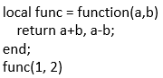
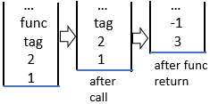

# Opcode

|                   name                   | argument   | description                              | example                                  | ShowingStackChange                       |
| :--------------------------------------: | :--------- | :--------------------------------------- | :--------------------------------------- | :--------------------------------------- |
|                   tag                    |            | used as a tag/label                      |                                          |                          |
|                pop_to_tag                |            | pop elements from stack, until pop a tag. |                                          |                   |
|            values_shift_to_1             |            | [end by a tag] make sure there has only one value. | `a,b = (func()), 2;-- make sure b equals to 2` | (1) (2) |
|                  local                   |            | declare variable(s) in current environment, and init them to default values(`nil`). | `local foo;` `local a, b;`               |                        |
|                local_init                |            | declare variable(s) in current environment, and init them to specify values. | `local a, b = 1, 2, 3`                   |                   |
|                table_get                 |            | used to access key-value of one specify table | `tab["key1"]` `tab[1 + 2]` `tab[func()]` |                    |
|              table_get_imm               | identifier | used to access key-value of one specify table by immediate string | `tab.name` `tab.socket.port` `tab._test` `func().key` |                                          |
|              table_set_tkt               |            |                                          | `tab['key'] ='value'; `                  |                |
| assign  add_assign  sub_assign  mul_assign  div_assign |            | a = b; a += b; a -= b;                   |                                          |  |
|                   add                    |            | `sub, mul, div, and, or, less, greater, less_eql, greater_eql, eql_eql, not_eql` are the same. | `1 + 2`                                  |                          |
|                   call                   |            | call a luax object                       | `func()` `func(a, b)` `tab[1]()` `func()()` |      |
|              func_args_init              |            | do the same thing as `local_init`, but generates a table `arguments` at the same time. |                                          |                                          |

**see [opcode.h](../src/opcode.h)**